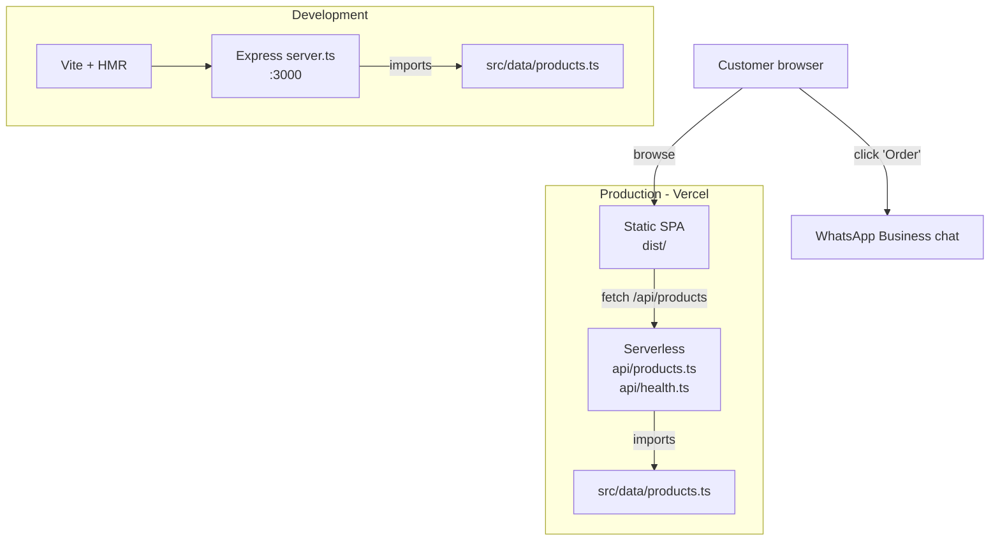

# Eliana Textiles

Luxury bedding storefront for Eliana Textiles — a Nairobi-based duvets, mattresses, and bed linen brand operating out of OTC Wholesale Mall. React 19 SPA with Express in dev and Vercel serverless in prod, tested with Vitest and Playwright.

**Live:** https://eliana-textiles.vercel.app

---

## Context

Eliana Textiles is a real, operating retail business. Most Nairobi SMBs at their stage either have no online presence or a Wix page that gets one update a year. The brief here was different: a storefront they own outright, with a real product catalogue, page transitions that match the brand's premium positioning, and an order-placement flow that integrates with how they actually do business — which is WhatsApp, not a payment gateway.

This is the storefront for that. Orders are placed via WhatsApp; the site does not process payments. The frontend is the entire customer-facing surface.

---

## Architecture

The same TypeScript source serves two runtimes: Express in development, Vercel serverless functions in production. The product catalogue lives in one file (`src/data/products.ts`) imported by both.



One source of truth (`products.ts`); two delivery mechanisms (`server.ts` and `api/`). Adding a product means editing one file.

---

## Tech stack

| Layer | Choice | Why |
|-------|--------|-----|
| Framework | React 19 + TypeScript + Vite | Fast HMR; ecosystem maturity; matches client's "premium" pacing |
| Styling | Tailwind CSS 4 (via `@tailwindcss/vite`) | v4's CSS-first config keeps theme tokens in one place |
| Animations | Framer Motion | Page transitions and product card motion that feel deliberate, not stock |
| Backend (dev) | Express + Vite dev middleware | Single `tsx server.ts` boots SPA + API together |
| Backend (prod) | Vercel serverless functions (`api/`) | Zero ops, generous free tier for an SMB-scale catalogue |
| AI | `@google/genai` (optional) | Gemini integration for future product Q&A; app works without it |
| Unit tests | Vitest + Testing Library | Catches catalogue and component regressions before deploy |
| E2E | Playwright | Smoke tests the catalogue and order flow against the running server |

Most SMB storefronts get shipped with zero tests. Both Vitest and Playwright run on every push.

---

## Local development

```bash
npm install
npm run dev          # Express + Vite HMR on :3000
```

Open http://localhost:3000.

### Environment

```bash
cp .env.example .env.local
```

| Variable | Required | Purpose |
|----------|----------|---------|
| `GEMINI_API_KEY` | No | Gemini integration; app works without it |
| `PORT` | No | Override dev server port (default 3000) |

---

## Commands

```bash
npm run dev          # Development server (Express + Vite HMR)
npm run build        # Vite SPA + esbuild server bundle
npm start            # Run production build locally
npm run lint         # TypeScript type-check (tsc --noEmit)

npm test             # Unit tests (Vitest)
npm run test:watch   # Vitest watch mode
npm run test:e2e     # Playwright E2E (needs dev server on :3000)
npm run test:e2e:ui  # Playwright UI mode
```

---

## Project layout

```
src/
├── App.tsx              # Root — owns all state
├── types.ts             # Shared TypeScript interfaces
├── data/products.ts     # Canonical product catalogue (KES prices)
├── components/          # Feature-driven UI components
├── lib/utils.ts         # cn() helper (clsx + tailwind-merge)
└── __tests__/           # Vitest unit tests

api/                     # Vercel serverless functions (production)
├── products.ts
└── health.ts

e2e/                     # Playwright specs
server.ts                # Express server (development)
vite.config.ts
playwright.config.ts
vitest.config.ts
```

---

## Deployment

The app deploys automatically to Vercel on push to `main`. The platform serves:

- **Static frontend** from `dist/` (built by `vite build`)
- **API routes** from `api/` (Vercel serverless functions)

Customer orders are placed through WhatsApp Business — no payment gateway is integrated. The site's job is to make the catalogue browsable and the brand feel right; closing happens in chat.

---

Built by **Kenn Macharia** — [SuperiaTech](https://superiatech.vercel.app/)
